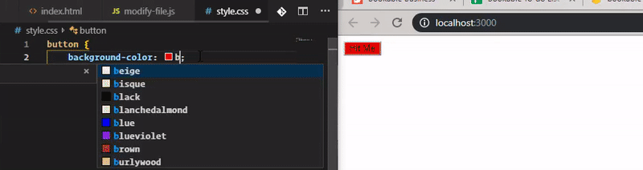

# SnapCss! 

Realtime editing style in a snap!

Idea behind, there is `_nghost-${COMPONENT_VARIABLE}` in every component in Angular. I Create websocket that listen to the chrome extension, the chrome seek `COMPONENT_VARIABLE` then send it to `vscode`. After that, vscode mix it that component variable with style and send it to chrome extension. then it will update it.

## Requirements
you need install for this plugin to work with:
- Chrome Browser [HERE](https://www.google.com/chrome/) 
- My chrome extension [HERE](https://chrome.google.com/webstore/detail/banpiopiepkejkfomncchpdokpnaejnh)

## Install
1. Open Extensions sideBar panel in Visual Studio Code. View → Extensions
2. Search for `SnapCss` then Click Install, Click Reload, if required
3. install chrome extension [HERE](https://chrome.google.com/webstore/detail/banpiopiepkejkfomncchpdokpnaejnh) if you not install yet

## Features

Imagine no more file saving or page reloading just to see how single update affects web page, realtime update style in browser immediately, as you type... How many time you can save? how fast we can build our application?

No need to waiting for JS framework build time to see your new style apply. Just type your new style and see the magic happen. 

Base on this idea [Livestyle](http://livestyle.io/). I'm writing an extension for VS code and Chrome that can help Angular developer (or frontend developer) can style faster. It call *SnapCss* that can updates CSS in browser immediately, as you type. No more file saving or page reloading just to see how single update affects web page.

Youtube video click on below image:

<!-- 
> Tip: Many popular extensions utilize animations. This is an excellent way to show off your extension! We recommend short, focused animations that are easy to follow. -->

<!-- ## Extension Settings

Include if your extension adds any VS Code settings through the `contributes.configuration` extension point.

For example:

This extension contributes the following settings:

* `myExtension.enable`: enable/disable this extension
* `myExtension.thing`: set to `blah` to do something -->

## Known Issues

<!-- Calling out known issues can help limit users opening duplicate issues against your extension. -->

> why my Console in Chrome browser keep yelling Error:
`GET http://localhost:1995/socket.io/?EIO=3&transport=polling&t=MmnbD6d net::ERR_CONNECTION_REFUSED` ???

- answer: Because you not open VSCode editor. You just open it and it will shut up or disable SnapCss chrome plugin.
- Still notworking if have @import() or ::ng-deep
## Release Notes

<!-- Users appreciate release notes as you update your extension. -->
## [0.0.9] - 2020-02-18
### Fixed
- Project work perfect, dont know why it not crash anymore.
Enable tracking by default

## [0.0.8] - 2019-08-15
### Fixed
- project error crash 3: 
CHANGED: change from sass.js to PostCss. Start working normally

## Feature Implement Process

- [x] Webpack bundle to make plugin faster.
- [x] Multi workspace SnapCss editing.

## Framework Implement Process

- [x] normal html/css website
- [x] Angular 2+
- [x] Ionic Angular
- [ ] Ionic Stencil
- [ ] React
- [ ] VueJS
- [ ] .NET
- [ ] PHP (lavarel)
- [ ] Wordpress

## Note
Give me the feedback, your request framework or new feature in [here](https://github.com/xanhtool/SnapCss/issues) or email me: hiepxanh@gmail.com 
<!-- -----------------------------------------------------------------------------------------------------------

## Working with Markdown

**Note:** You can author your README using Visual Studio Code.  Here are some useful editor keyboard shortcuts:

* Split the editor (`Cmd+\` on macOS or `Ctrl+\` on Windows and Linux)
* Toggle preview (`Shift+CMD+V` on macOS or `Shift+Ctrl+V` on Windows and Linux)
* Press `Ctrl+Space` (Windows, Linux) or `Cmd+Space` (macOS) to see a list of Markdown snippets

### For more information

* [Visual Studio Code's Markdown Support](http://code.visualstudio.com/docs/languages/markdown)
* [Markdown Syntax Reference](https://help.github.com/articles/markdown-basics/)

**Enjoy!** -->
